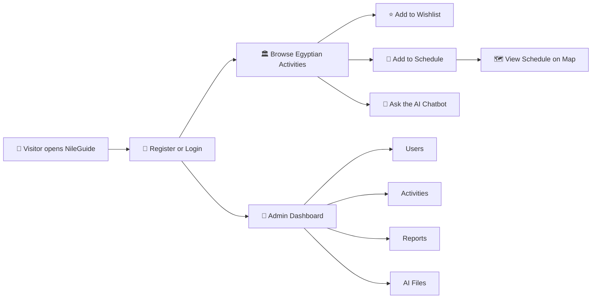

<div align="center">


<br />


<br />


<br />
<br />

**NileGuide** is a polished Angular travel platform for discovering Egyptian activities, building trip plans, managing wishlists, viewing scheduled stops on a map, chatting with an AI assistant, and running admin workflows from one dashboard.

<br />

| 🏛️ Tourist Experience | 🗺️ Smart Planning | 🤖 AI Assistance | 👑 Admin Control |
| --- | --- | --- | --- |
| Browse and review activities | Schedule trips and map locations | Tourist chatbot experience | Manage users, activities, reports |

</div>

---

## ✨ Pharaoh Mode

> From pyramids to river cruises, NileGuide turns an Egypt trip into a guided digital journey.

<div align="center">

```text
𓂀  Discover  ->  Save  ->  Schedule  ->  Navigate  ->  Experience  𓂀
```

</div>

---

## 📜 Table of Contents

- [Project Story](#-project-story)
- [Experience Flow](#-experience-flow)
- [Core Features](#-core-features)
- [Tech Stack](#-tech-stack)
- [Project Structure](#-project-structure)
- [Environment Configuration](#-environment-configuration)
- [Getting Started](#-getting-started)
- [Available Scripts](#-available-scripts)
- [Application Routes](#-application-routes)
- [Security Notes](#-security-notes)
- [Build and Deployment](#-build-and-deployment)
- [Code Quality](#-code-quality)
- [Team Handoff](#-team-handoff)

---

## 🐪 Project Story

NileGuide helps tourists explore Egypt through a modern travel interface. Users can register, discover curated activities, inspect details and reviews, save favorites, build a schedule, and view planned stops on an interactive map.

Admins get a separate dashboard to manage activities, users, reports, and chatbot files. The platform is built with Angular standalone components and Angular SSR for a cleaner production-ready architecture.

---

## 🧭 Experience Flow



---

## 🏺 Core Features

| Feature | What it does |
| --- | --- |
| 🔐 Tourist Authentication | Register, login, logout, role detection, forgot password, reset password |
| 🏛️ Activities Explorer | Search, filter by city/category, sort, paginate, view details, read and create reviews |
| ⭐ Wishlist | Save and remove favorite activities for authenticated tourists |
| 📅 Trip Schedule | Add activities to a personal trip plan and remove scheduled items |
| 🗺️ Interactive Map | Display scheduled activities by coordinates with Google Maps when configured |
| 🤖 AI Chatbot | Tourist chatbot interface plus admin file-management workflow |
| ✉️ Contact Form | EmailJS-powered contact flow when configured |
| 📄 Static Pages | Privacy, terms, help center, contact, and home pages |
| 👑 Admin Dashboard | Manage users, activities, reports, and chatbot resources |
| ⚡ SSR | Angular SSR server entry with server route configuration |

---

## 🧱 Tech Stack

| Layer | Tools |
| --- | --- |
| ⚙️ Framework | Angular 21, Angular Router, Angular SSR |
| 🧠 Language | TypeScript 5.9 |
| 🎨 UI | Tailwind CSS 4, Flowbite, Font Awesome, ng-icons |
| 🧾 Forms | Angular Reactive Forms |
| 🌐 HTTP | Angular HttpClient with auth and cache interceptors |
| 📊 Charts | ApexCharts |
| 🧳 Documents | jsPDF, jsPDF AutoTable |
| 🔔 Feedback | ngx-toastr, ngx-spinner |
| 🚀 Runtime | Node.js, Express SSR server |
| 🧪 Testing | Angular test runner with Vitest configuration |

---

## 🏗️ Project Structure

```text
src/
  app/
    core/
      components/       Shared navbar, footer, chatbot
      constants/        Storage keys and API base URL
      guards/           Tourist/admin route guards
      interceptors/     Auth and cache HTTP interceptors
      layouts/          Guest and authenticated layouts
      services/         Shared infrastructure services
    features/
      activities/       Activity listing, filters, details models, API service
      admin/            Dashboard, users, activities, reports, chatbot admin
      auth/             Login, register, forgot/reset password
      contact/          Contact form and EmailJS integration
      details/          Activity details page
      help-center/      Help center page
      home/             Home page sections
      map/              Schedule map view
      privacy/          Privacy page
      profile/          Tourist profile page
      schedule/         Trip schedule feature
      terms-of-service/ Terms page
      wishlist/         Tourist wishlist
  environments/         Public runtime placeholders for frontend integrations
  styles/               Global style layers
public/
  Photo/                Application images
  ico/                  Favicon and app icon assets
```

---

## 🔑 Environment Configuration

Frontend public configuration lives in:

```text
src/environments/environment.ts
src/environments/environment.development.ts
```

Current placeholders:

```ts
export const environment = {
  production: false,
  googleMapsApiKey: '',
  emailJs: {
    serviceId: '',
    templateId: '',
    publicKey: '',
  },
};
```

Important notes:

- Do not commit passwords, admin credentials, personal demo accounts, `.env` files, generated reports, videos, or local screenshots.
- Google Maps and EmailJS browser keys are client-visible by design. Restrict them from provider dashboards by domain and allowed API usage.
- Backend API base URL is currently defined in `src/app/core/constants/Stored_keys.ts`.
- Real production secrets belong on the backend, not in Angular source files.

---

## 🚀 Getting Started

### Prerequisites

- Node.js compatible with Angular 21
- npm 10+
- A running NileGuide backend API
- Optional Google Maps API key for the map page
- Optional EmailJS service/template/public key for the contact page

### Install

```bash
npm install
```

### Run Locally

```bash
npm start
```

Open:

```text
http://localhost:4200
```

### Build

```bash
npm run build
```

Build output:

```text
dist/G.Project
```

### Run SSR Build

```bash
npm run build
npm run serve:ssr:G.Project
```

Default SSR port:

```text
http://localhost:4000
```

---

## 🧪 Available Scripts

| Command | Purpose |
| --- | --- |
| `npm start` | Start Angular development server |
| `npm run build` | Build production browser and SSR bundles |
| `npm run watch` | Build in watch mode for development |
| `npm test` | Run Angular tests |
| `npm run serve:ssr:G.Project` | Serve the SSR production bundle |

---

## 🧿 Application Routes

| Route | Access | Description |
| --- | --- | --- |
| `/home` | Public | Landing and home experience |
| `/auth/login` | Guest | Tourist/admin login |
| `/auth/register` | Guest | Tourist registration |
| `/auth/forget-password` | Guest | Password reset request |
| `/activities` | Tourist | Browse activities |
| `/activities/:id` | Tourist | Activity details and reviews |
| `/wishlist` | Tourist | Saved activities |
| `/schedule` | Tourist | Personal trip plan |
| `/map` | Tourist | Scheduled activities on map |
| `/profile` | Tourist | Profile page |
| `/dashboard` | Admin | Admin dashboard shell |
| `/dashboard/users-management` | Admin | User management |
| `/dashboard/activities-management` | Admin | Activity management |
| `/dashboard/reports` | Admin | Reports management |
| `/contact` | Public | Contact form |
| `/privacy` | Public | Privacy policy |
| `/terms` | Public | Terms of service |
| `/help` | Public | Help center |

---

## 🛡️ Security Notes

The repository is cleaned to avoid committing non-code artifacts and sensitive local material.

Removed from source control:

- Local demo scripts and demo credential templates
- Generated screenshots, recordings, PDF/DOCX/PPTX deliverables, and archives
- Local editor/Cursor workspace files
- Generated logs and Playwright reports
- Hardcoded Google Maps API key
- Hardcoded EmailJS service/template/public key

Recommended rules:

- Keep `.env` and local credential files out of Git.
- Restrict browser-exposed public keys from provider dashboards.
- Rotate any key that was previously committed to a public repository.
- Keep admin credentials only in the backend identity system or a secure password manager.

---

## 🏗️ Build and Deployment

The app supports a standard Angular production build and an SSR server bundle.

Deployment checklist:

1. Configure backend API URL.
2. Configure public Google Maps and EmailJS values if the related features are enabled.
3. Run `npm install`.
4. Run `npm run build`.
5. Deploy `dist/G.Project` according to the selected hosting target.
6. For SSR hosting, start `dist/G.Project/server/server.mjs`.

---

## ✅ Code Quality

The codebase follows these conventions:

- Standalone Angular components
- Feature-first folder organization
- Route guards for protected tourist/admin pages
- Central auth state service
- HTTP interceptors for auth/cache behavior
- Shared layout components for guest and authenticated experiences
- Environment placeholders instead of committed keys

Before pushing:

```bash
npm run build
npm test
```

---

## 👑 Team Handoff

| File | Why it matters |
| --- | --- |
| `src/app/app.routes.ts` | Main client routing |
| `src/app/app.routes.server.ts` | SSR rendering strategy |
| `src/app/core/constants/Stored_keys.ts` | API base URL and storage keys |
| `src/app/core/guards/auth.guards.ts` | Role-based route protection |
| `src/app/core/interceptors/auth.interceptor.ts` | Auth header injection |
| `src/app/features/auth/services/auth.service.ts` | Login/register/reset auth flow |
| `src/app/features/activities/activities.service.ts` | Activities API integration |
| `src/app/features/schedule/schedule.service.ts` | Trip plan API integration |
| `src/environments/environment.ts` | Production public integration placeholders |

---

<div align="center">


<br />

**𓂀 NileGuide 𓂀**

</div>
